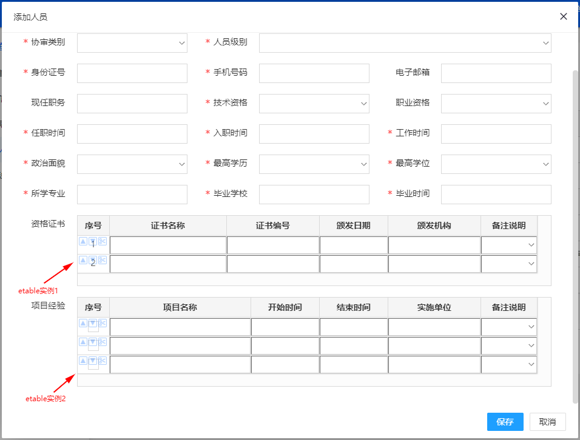

# etable

## 一款基于jQuery的轻量级可编辑表格插件，适用于快速录单等应用场景，支持键盘操作

---

#### 开发缘由和插件介绍

工作中经常碰到一种需求场景，当我们在添加数据记录的时候，其附带的一些数据需要以关联数据（在数据库中表现为关联的数据表）形式一同添加，比如在采购单录单、添加人员基本信息时需要一同填写人员的履历、经验和获奖证书等情况，而这些关联数据本身又是一条一条的记录，所以亟需一种可编辑的子表格，能方便嵌入到现有表单中。

网络上这种类似的功能插件很多，但不是太复杂就是操作太繁琐，也往往和录单本身需要的功能初心相悖，所以自己就做了一个类似的插件，以便可以重复使用。这个插件完全是用在web前端页面的，可方便嵌入到web应用中，考虑到时间问题，所以用了jQuery实现，有点类似于easyui的datagrid，但easyui的datagrid默认不支持键盘操作和新增删除列，需要自己扩展，索性就自己单独实现一个轻量的类datagrid插件，应该说适合自己的才是最好的。

#### 插件演示




#### 插件使用

1.  严格按照如下方式建立页面结构

```html
<div> <!-- 这层结构是必须的 -->
    <table id="etable1">
        <thead> <!-- thead是必须的 -->
            <tr>
                <th style="40px;"></th> <!-- 注意是th不是td -->
                <th style="100px;">证书名称</th>
                <th style="100px;">证书编号</th>
                <th style="100px;">颁发日期</th>
                <th style="100px;">颁发机构</th>
                <th style="100px;">备注</th>
            </tr>
        </thead>

        <tbody> <!-- tbody是必须的 -->
            <tr>
                <td></td> <!-- 这里才是td -->
                <td></td>
                <td></td>
                <td></td>
                <td></td>
                <td></td>
            </tr>
        </tbody>
    </table>

    <table id="etable2">
        <thead> <!-- thead是必须的 -->
            <tr>
                <th style="40px;"></th> <!-- 注意是th不是td -->
                <th style="100px;">证书名称</th>
                <th style="100px;">证书编号</th>
                <th style="100px;">颁发日期</th>
                <th style="100px;">颁发机构</th>
                <th style="100px;">备注</th>
            </tr>
        </thead>

        <tbody> <!-- tbody是必须的 -->
            <tr>
                <td></td> <!-- 这里才是td -->
                <td></td>
                <td></td>
                <td></td>
                <td></td>
                <td></td>
            </tr>
        </tbody>
    </table>
</div>
```

2.  引入jQuery.js、laydate.js、etable.js


```shell
# git clone https://gitee.com/funsent/etable.git
```

```javascript
<script src="jQuery.js"></script>
<script src="layer.js"></script>
<script src="laydate.js"></script>
<script src="etable.js"></script>
```

> jQuery 、laydate 请自行到相关网站下载


3.  初始化上述table，使之编程可编辑的表格

```javascript
let values = {0:'禁用', 1:'启用'}; // select下拉框的可选数据来源

funsent.etable.init('#etable1', {
    tag: 'etable1_tag'
    row_number: 3,
    editable_row_max: 10, // 新增参数，限制可编辑行数上限
    enable_keyboard: true,
    enable_tab_insert: true,
    enable_button: true,
    columns: [
        {type:'checkbox', name:'id', value:'', readonly:false},
        {type:'text', name:'name', value:'', align:'left', readonly:false},
        {type:'text', name:'certno', value:'', align:'left', readonly:false},
        {type:'date', name:'issue_time', value:'', align:'center', readonly:true},
        {type:'text', name:'issue_body', value:'', align:'left', readonly:false},
        {type:'select', name:'remark', value:'1', align:'left', readonly:false, values:values, style:{padding:'4px 4px 5px'}},
    ]
});

funsent.etable.init('#etable2', {
    tag: 'etable2_tag'
    row_number: 3,
    editable_row_max: 10, // 新增参数，限制可编辑行数上限
    enable_keyboard: true,
    enable_tab_insert: true,
    enable_button: true,
    columns: [
        {type:'checkbox', name:'id', value:'', readonly:false},
        {type:'text', name:'name', value:'', align:'left', readonly:false},
        {type:'text', name:'certno', value:'', align:'left', readonly:false},
        {type:'date', name:'issue_time', value:'', align:'center', readonly:true},
        {type:'text', name:'issue_body', value:'', align:'left', readonly:false},
        {type:'select', name:'remark', value:'1', align:'left', readonly:false, values:values, style:{padding:'4px 4px 5px'}},
    ]
});
```
> 以上即完成了etable插件的页面载入和使用

4.  数据收集

> 如果需要提交表单数据到后台，可用如下方法

```javascript
// 获取方法一：参数以字符串样式给出
let arr = funsent.etable.data('#etable1'); // 以上HTML结构中，获取的是etable1中的数据
let arr = funsent.etable.data('#etable2'); // 以上HTML结构中，获取的是etable2中的数据

// 获取方法二: 参数以dom对象或jQuery对象形式给出
let arr = funsent.etable.data(document.querySelector('#etable1')); // 以上HTML结构中，获取的是etable1中的数据
let arr = funsent.etable.data(document.querySelector('#etable2')); // 以上HTML结构中，获取的是etable2中的数据
let arr = funsent.etable.data($('#etable1')); // 以上HTML结构中，获取的是etable1中的数据
let arr = funsent.etable.data($('#etable2')); // 以上HTML结构中，获取的是etable2中的数据

// 获取方法三：参数以实例化顺序索引给出
let arr = funsent.etable.data(0); // 以上HTML结构中，获取的是etable1中的数据
let arr = funsent.etable.data(1); // 以上HTML结构中，获取的是etable2中的数据

// 获取方法思：参数以自定义标签给出
let arr = funsent.etable.data({tag:'etable1_tag'}); // 以上HTML结构中，获取的是etable1中的数据
let arr = funsent.etable.data({tag:'etable2_tag'}); // 以上HTML结构中，获取的是etable2中的数据
```

>  返回的是json对象数组，如果提交到服务器后，则请自行处理

#### 数据调试

```javascript
// 新增的info方法用于输出etable内部存储的数据格式，供大家开发调试时使用
console.log(funsent.etable.info());
```

#### 插件已实现列类型

1. 序号列（不可编辑，但是用插件去维护序号）
2. 原始数据列（不可编辑，保持原有td元素的值，或者可选择设置空字符串值）
3. 复选框checkbox列（编辑列，始终居中，可传入默认值，支持常用样式定义）
4. 下拉选择select列（编辑列，可传入默认值和下拉数据源，支持常用样式定义）
5. 普通文本text列（编辑列，可传入默认值，支持常用样式定义）
6. 日期选择date列（编辑列，普通文本text列的变种，默认只选不写）

#### 插件特点

- 支持列配置，通过传入对象数组配置列，有点类似于datagrid的传参方式
- 支持参数配置，通过调用config方法，传入json对象格式的参数
- 支持工具按钮，目前实现了上方插入行、下方插入行、删除行这三个功能
- 支持键盘按键操作，支持上下左右方向键、回车键、TAB键等操作
- 支持最后一个元素上按TAB键新增行功能（这点在快速录单中特别需要）
- 支持获取列数据，可用于表单提交
- 支持序号自维护（这点也是客户特别需要的）
- 支持某行某列不启用编辑功能
- 支持是否启用按键、是否启用工具按钮等独立配置参数


#### 意见建议

微信：younggf
QQ: 2018708
备注：etable插件
